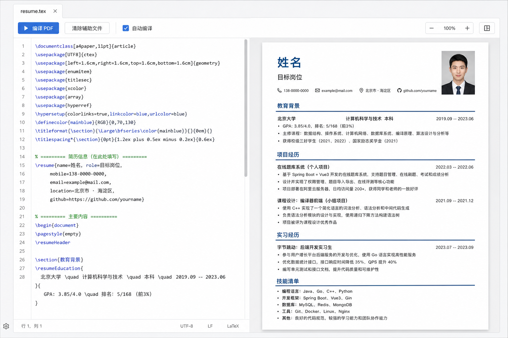

# 中文在线简历编辑器



一个面向中文求职场景的在线简历编辑器。登录后左侧使用 TeX-like 源码编辑，右侧实时渲染为 A4 简历预览，并通过浏览器打印导出 PDF。源码和照片草稿会保存到 MySQL，并按账号隔离。

## 功能

- 左侧 CodeMirror 源码编辑器，支持行号、基础高亮和错误提示。
- 右侧 A4 简历实时预览，内容超出后自动流到下一页。
- 简历样式面向通用求职投递：中文无衬线字体、明确页边距、蓝色章节标题横线、紧凑但可读的项目描述。
- 支持开放注册和登录，登录态使用 HttpOnly Cookie。
- 简历源码和照片草稿保存到 MySQL，用户之间通过账号隔离。
- 支持从旧版浏览器 `localStorage` 草稿首次导入到当前账号。
- 支持上传一寸照，源码只保留 `\photo{local}`，照片数据随草稿保存。
- 点击“导出 PDF”调用浏览器打印，只输出 A4 简历区域。

## 本地运行

```bash
npm install
npm run dev
npm run dev:api
```

默认访问地址通常是：

```text
http://127.0.0.1:5173
```

构建和检查：

```bash
npm run build
npm run build:api
npm run lint
```

本地 API 需要 MySQL。可参考 `deploy/.env.example` 配置数据库，或直接使用 Docker Compose 启动完整环境。

## 简历源码语法

这个项目没有实现完整 LaTeX，而是实现了一套轻量 TeX-like DSL。常用命令如下：

```tex
\resume{
  name=姓名,
  role=目标岗位,
  contact=电话：（+86） xxxxx | 邮箱：xxxxxxx
          籍贯：xxxxx
}
\photo{local}

\section{教育背景}
\entry{学校名称}{专业名称 · 学历}{开始时间-结束时间}
\field{学校标签}{如：985、211、双一流、重点实验室；没有可删除}
\field{奖项荣誉}{填写奖学金、竞赛奖项、学生工作或其他校园荣誉。}
\field{研究方向}{填写研究方向、主修方向或课程重点；没有可删除。}

\section{项目经历}
\entry{项目名称}{}{项目时间}
\field{项目介绍}{填写项目背景、业务目标、个人职责和最终效果。}
\field{技术栈}{按实际使用填写，例如框架、数据库、消息队列、前端技术等。}
\field{核心内容}{}
\bullet{系统设计：填写你负责的模块、核心流程、接口设计或领域模型。}
```

完整语法说明见 [docs/resume-dsl.md](docs/resume-dsl.md)。

照片说明：点击“插入照片”上传 `jpg/jpeg/png/webp`，文件最大 `5MB`。浏览器会本地裁剪压缩为一寸照比例，源码只插入短命令 `\photo{local}`，照片数据保存到当前账号的数据库草稿中。

## 项目结构

```text
src/
  App.tsx      # 编辑器、DSL 解析、分页和简历渲染
  App.css      # 页面布局、A4 简历样式和打印样式
  index.css    # 全局基础样式
  main.tsx     # React 入口
api/
  server.ts    # Express API、认证、MySQL 草稿持久化
deploy/
  docker-compose.yml
  nginx.conf
```

## 导出 PDF

点击页面右上角“导出 PDF”，选择浏览器打印里的“另存为 PDF”。打印样式会隐藏编辑区和工具栏，只保留 A4 简历页。

## Docker 部署

本项目通过 Docker Compose 部署为 Web、API、MySQL 三个服务。Web 对外暴露 `8081`，API 由 Nginx 反向代理到 `/api`。

本地 Docker 运行：

```bash
cp deploy/.env.example deploy/.env
docker compose -f deploy/docker-compose.yml --env-file deploy/.env up -d --build
```

默认访问：

```text
http://127.0.0.1:8081
```

健康检查：

```bash
curl http://127.0.0.1:8081/health
curl http://127.0.0.1:8081/api/health
```

远程部署脚本：

```bash
scripts/deploy-static.sh root@example.com /opt/resume-template-web
```

脚本会在本地构建检查项目，将源码打包上传到服务器，并在服务器上通过 Docker Compose 启动完整服务。默认使用服务器 `8081` 端口；如需修改，编辑服务器上的 `deploy/.env`。
